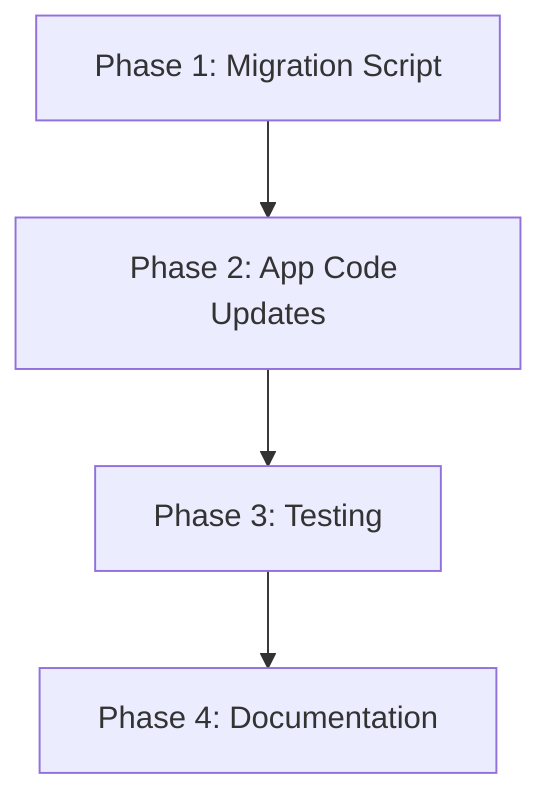

# Task Checklist: Modernize Oracle Schema & Fix Data Model Parity

**Requirement**: modernize-oracle-schema
**Status**: Planning → Implementation
**Updated**: 2025-10-17

---

## High-Level Tasks

### Phase 1: Migration Script Creation ⏳
**Owner**: Implementation Agent
**Estimated**: 30 minutes

- [ ] Create migration file: `0002_add_store_table_and_modernize_types.sql`
- [ ] Write upgrade script for store table
- [ ] Write upgrade script for boolean type changes
- [ ] Write upgrade script for timestamp type changes
- [ ] Write complete downgrade script
- [ ] Test migration on clean database

### Phase 2: Application Code Updates ⏳
**Owner**: Implementation Agent
**Estimated**: 20 minutes

- [ ] Update `app/db/utils.py` - add store to COFFEE_SHOP_TABLES
- [ ] Review `app/services/product.py` - verify boolean handling
- [ ] Review `app/services/metrics.py` - verify boolean handling
- [ ] Update `_reset_sequences()` to include store table
- [ ] Check for any SQL queries using `= 1` instead of `= TRUE`

### Phase 3: Testing & Verification ⏳
**Owner**: Testing Agent
**Estimated**: 30 minutes

- [ ] Test migration: upgrade from 0001 → 0002
- [ ] Test migration: downgrade from 0002 → 0001
- [ ] Load all fixtures: `uv run app db load-fixtures`
- [ ] Verify store table has 15 rows
- [ ] Verify boolean columns work correctly
- [ ] Verify timestamp columns have timezone info
- [ ] Run integration test suite

### Phase 4: Documentation ⏳
**Owner**: Docs & Vision Agent
**Estimated**: 30 minutes

- [ ] Update `app/db/migrations/README.md`
- [ ] Create/update `docs/guides/schema-design.md`
- [ ] Update main README.md with schema notes
- [ ] Document Oracle vs PostgreSQL parity
- [ ] Clean up temp files from `specs/active/*/tmp/`

---

## Agent Assignments

### Implementation Agent
- Phases 1 & 2
- Create migration script
- Update application code
- Initial testing

### Testing Agent
- Phase 3
- Comprehensive testing
- Integration test validation
- Performance verification

### Docs & Vision Agent
- Phase 4
- Documentation updates
- Schema documentation
- Cleanup temp files

---

## Dependencies

---

## Success Criteria Checklist

- [ ] All fixtures load without errors
- [ ] Store table exists with correct schema
- [ ] Boolean columns use native BOOLEAN type
- [ ] Timestamps use TIMESTAMP WITH TIME ZONE
- [ ] Migration upgrade/downgrade work
- [ ] Application starts successfully
- [ ] Integration tests pass
- [ ] Documentation complete

---

## Notes

- This is a **schema-breaking change** - requires database rebuild or careful migration
- Recommendation: Fresh database creation for demo apps
- Production deployments should use staged migration approach (see PRD)
