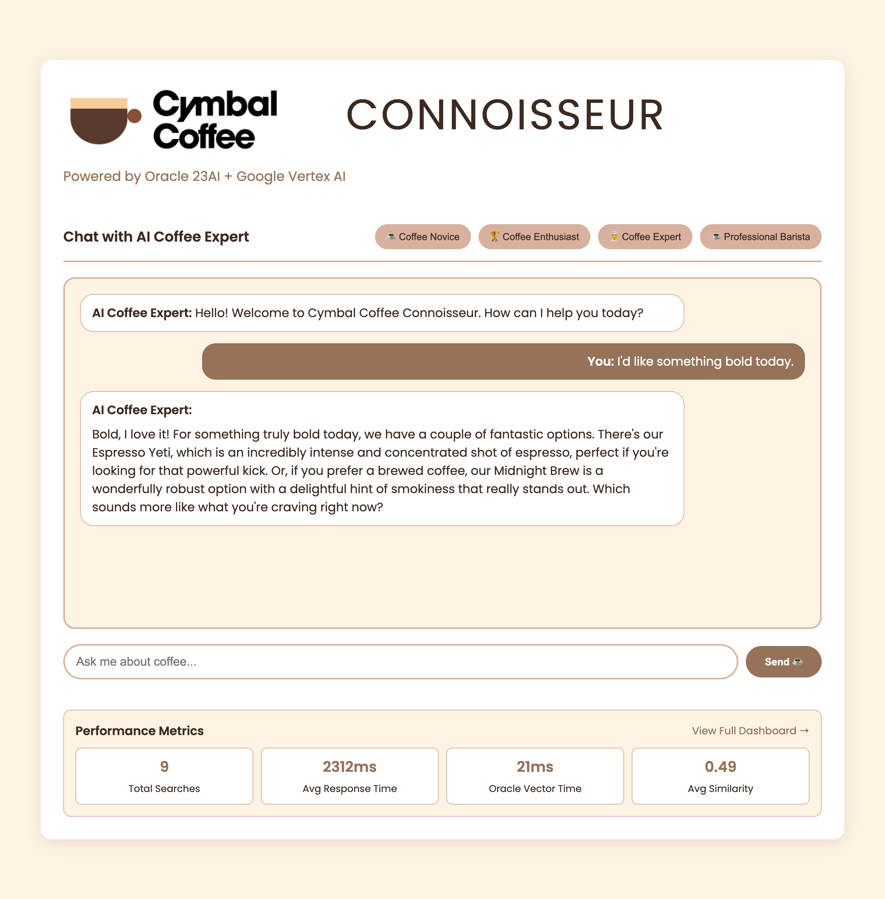
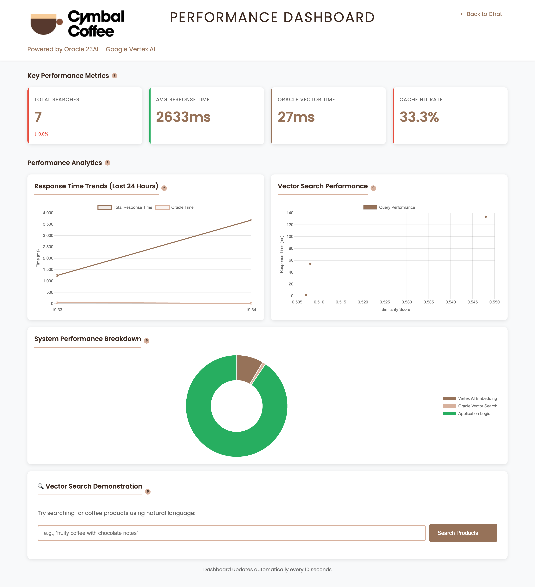

# ☕ Oracle + Vertex AI Coffee Demo

An intelligent coffee recommendation system showcasing Oracle 23AI vector search with Google Vertex AI integration.

## 🚀 Quick Start

```bash
# Install dependencies with uv
make install-uv # Installs Astral's UV Python manager
make install

# Setup environment
cp .env.example .env  # Edit with your API keys

# Start Oracle 23AI
make start-infra
uv run app load-fixtures

# Start the application
uv run app run
```

**Note: Embedding are included in the gzipped fixtures.**
If you'd like to regenerate embeddings, you can use:

```sh
uv run app load-vectors
```

Visit [http://localhost:5006](http://localhost:5006) to try the demo!

## 🖼️ Screenshots

### Coffee Chat Interface


_AI-powered coffee recommendations with real-time performance metrics_

### Performance Dashboard


_Live monitoring of Oracle vector search performance and system metrics_

## 📚 Documentation

For complete implementation and development guides, see the [`docs/system/`](docs/system/) directory:

- **[Technical Overview](docs/system/01-technical-overview.md)** - High-level technical concepts
- **[Oracle Architecture](docs/system/02-oracle-architecture.md)** - Oracle 23AI unified platform
- **[Implementation Guide](docs/system/05-implementation-guide.md)** - Step-by-step build guide

### Recent Architecture Updates

- **[Architecture Updates](docs/architecture-updates.md)** - Recent improvements including:
  - Native HTMX integration with Litestar
  - Centralized exception handling system
  - Unified cache information API
  - Enhanced cache hit tracking
- **[HTMX Events Reference](docs/htmx-events.md)** - Complete list of custom HTMX events
- **[HTMX Migration Summary](docs/htmx-migration-summary.md)** - Details of the HTMX native integration
- **[Demo Scenarios](docs/system/07-demo-scenarios.md)** - Live demonstration scripts

## 🏗️ Architecture

This demo uses:

- **Oracle 23AI** - Complete data platform with native vector search
- **Vertex AI** - Google's generative AI platform for embeddings and chat
- **Minimal Abstractions** - Direct Oracle database access for clarity (and performance). No ORM
- **Litestar** - High-performance async Python framework
- **HTMX** - Real-time UI updates without JavaScript complexity

## 🎯 Key Features

This implementation is designed for conference demonstration with:

- **Real-time Chat Interface** - Personalized coffee recommendations with AI personas
- **Live Performance Metrics** - Oracle vector search timing and cache hit rates
- **In-Memory Caching** - High-performance response caching using Oracle
- **Native Vector Search** - Semantic similarity search without external dependencies
- **Intent Routing** - Natural language understanding via exemplar matching
- **Performance Dashboard** - Real-time monitoring of all system components

## 🔧 Development Commands

```bash
# Database operations
uv run app load-fixtures        # Load sample data
uv run app load-vectors         # Generate embeddings
uv run app truncate-tables      # Reset all data
uv run app clear-cache          # Clear response cache

# Export/Import (for faster demo startup)
uv run app dump-data           # Export all data with embeddings
uv run app dump-data --table intent_exemplar  # Export specific table
uv run app dump-data --path /tmp/backup --no-compress  # Custom options

# Development
uv run app run                 # Start the application
uv run pytest                  # Run tests
make lint                      # Code quality checks
```

## 📖 Additional Resources

- [Original Blog Post](https://cloud.google.com/blog/topics/partners/ai-powered-coffee-nirvana-runs-on-oracle-database-on-google-cloud/) - Origin story
- [Oracle 23AI Vector Guide](https://docs.oracle.com/en/database/oracle/oracle-database/23/vecse/) - Vector search documentation
- [Litestar Documentation](https://docs.litestar.dev) - Framework documentation
- [System Documentation](docs/system/) - Complete technical guides
