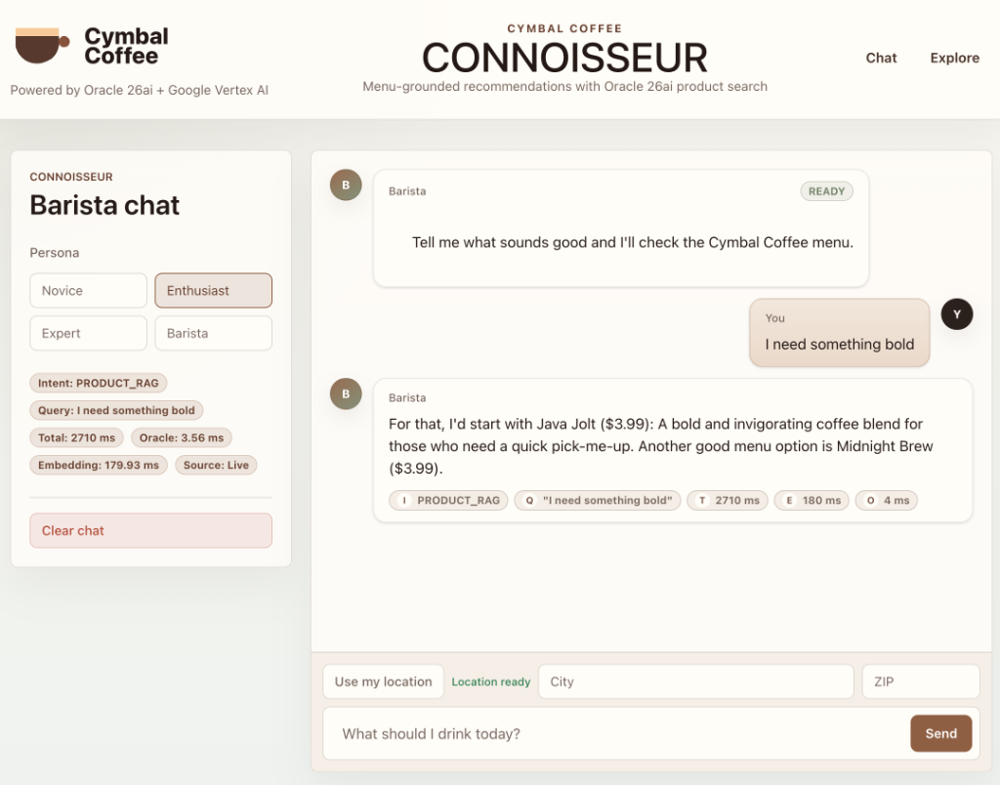

# Cymbal Coffee: Oracle 26ai + Vertex AI + ADK

Reference app for AI-powered product search on Oracle Database 26ai with Google
ADK 2.0, Vertex AI, SQLSpec, Litestar, HTMX, and Vite.

<div align="center">
  
</div>

## Quickstart

Prerequisites: Python 3.12+, Docker or Podman-compatible local containers,
`make`, and Google Vertex AI credentials.

```bash
make install
uv run python manage.py init
make start-infra
uv run coffee upgrade
uv run coffee run
```

`make install` bootstraps `uv` if it isn't already on your PATH, then
installs Python and frontend dependencies and builds the Vite assets that
Litestar serves. `manage.py init` walks you through `.env` (deployment mode,
database connection, Vertex AI project) without re-running the install.

Open <http://localhost:5006>. The chat page is `/`; the Oracle vector explorer
is `/explore`.

If `.env` still has `VERTEX_AI_PROJECT_ID=demo-project`, chat returns a
clean 503 until real Vertex AI credentials are configured. Use Application
Default Credentials or set `GOOGLE_API_KEY` / `VERTEX_AI_API_KEY`.

## What's Inside

- 122 Cymbal Coffee products, 16 stores, and committed `gemini-embedding-001` fixtures.
- Oracle `VECTOR(3072, FLOAT32)` storage with HNSW INMEMORY indexes.
- Deterministic product, store, and availability chat routes with an ADK 2.0 general-chat fallback.
- HTMX + Tailwind + vanilla JavaScript pages for chat and vector-plan exploration.
- Oracle-backed response cache, embedding cache, metrics, Litestar sessions, and ADK sessions.

## End-user commands

| Command | Purpose |
| --- | --- |
| `uv run coffee run` | Start the Granian + Litestar dev server |
| `uv run coffee upgrade` | Apply migrations and load committed demo data |
| `uv run coffee clear-cache --force` | Clear response and embedding caches |
| `uv run coffee model-info` | Check active model configuration |

## Documentation

The published docs site is the home for the long-form material:

- **Walkthrough** — what one chat message actually does, end to end.
- **Concepts** — vectors in Oracle, RAG, Google ADK, and map links.
- **Reference** — quickstart, CLI reference, and a "for the curious" appendix.
- **Developers** — raw migration entrypoint, fixture regeneration, and
  verification commands. Start here if you intend to modify the demo.

External references:

- Oracle vectors: <https://docs.oracle.com/en/database/oracle/oracle-database/23/vecse/>
- Vertex AI: <https://cloud.google.com/vertex-ai/docs>
- Litestar: <https://docs.litestar.dev/>
- SQLSpec: <https://sqlspec.dev>

## Troubleshooting

AI service returns 503:
Replace placeholder Vertex settings in `.env` and confirm ADC or API-key auth.
`uv run coffee model-info` shows the active model settings.

HNSW migration fails with `ORA-51962`:
Restart the local database after `vector_memory_size` is configured.

Chat feels slow:
Use `/explore` to inspect Oracle timing and EXPLAIN PLAN output, then clear stale
caches with `uv run coffee clear-cache --force` before re-testing.
