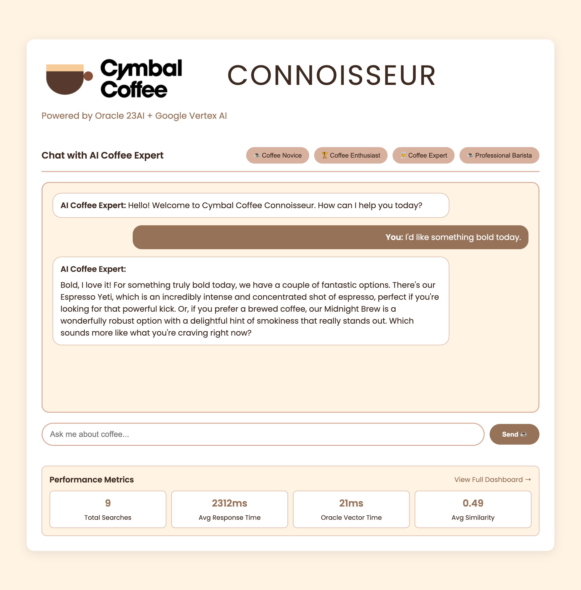
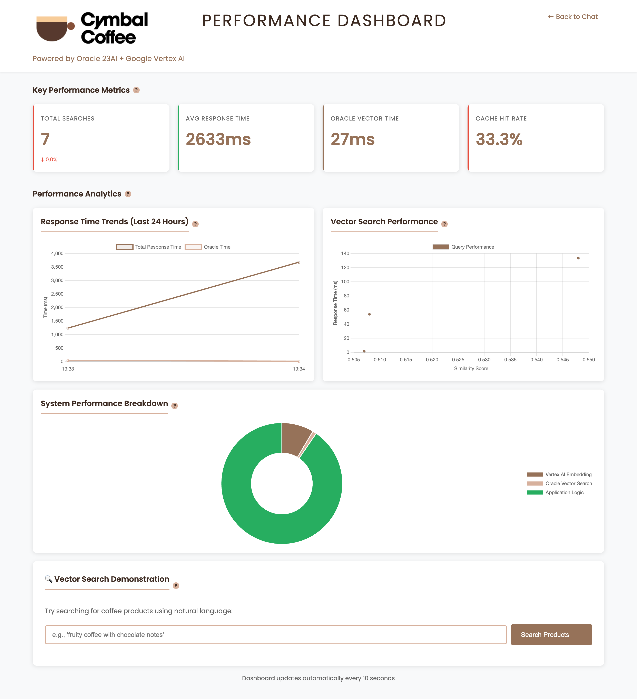

# ☕ Oracle + Vertex AI Coffee Demo

An intelligent coffee recommendation system showcasing Oracle 23AI vector search with Google Vertex AI integration.

## 🚀 Quick Start

### Recommended: Automated Setup (New!)

The fastest way to get started is using our unified management CLI:

```bash
# Install UV Python manager (if not already installed)
make install-uv
# Initialize project and install prerequisites
make install
uv run manage.py init --run-install

# Verify setup
uv run manage.py doctor

# Start Oracle 23ai (managed mode - local container)
uv run manage.py infra start

# Run database migrations
uv run python manage.py database upgrade

# Load sample data
uv run coffee load-fixtures

# Start the application
uv run coffee run
```

Visit [http://localhost:5006](http://localhost:5006) to try the demo!

**Management CLI Commands:**

```bash
# Setup and initialization
uv run manage.py init                                          # Initialize project (creates .env interactively)
uv run manage.py install all                                   # Install all prerequisites
uv run manage.py doctor                                        # Verify setup and prerequisites

# Database management (managed mode - local container)
uv run manage.py infra start                                   # Start Oracle container
uv run manage.py infra stop                                    # Stop Oracle container
uv run manage.py infra restart                                 # Restart Oracle container
uv run manage.py infra logs                                    # View container logs
uv run manage.py infra wipe                                    # Remove container (clean slate)

# Database management (external mode - Autonomous DB)
uv run manage.py database wallet extract Wallet_*.zip         # Extract wallet
uv run manage.py database connect test                        # Test database connection

# Help
uv run manage.py --help                                        # Show all available commands
```

### Manual Setup

For more control over the setup process:

```bash
# Step 1: Install UV Python manager
make install-uv

# Step 2: Install project dependencies
make install

# Step 3: Initialize environment (creates .env interactively)
uv run manage.py init

# Step 4: Start Oracle 23AI container
make start-infra

# Step 5: Run database migrations
uv run python manage.py database upgrade

# Step 6: Load sample data
uv run coffee load-fixtures

# Step 7: Start the application
uv run coffee run
```

**Reset Database (Clean Slate):**

To completely reset your local Oracle installation with no tables deployed:

```bash
make wipe-infra
# Then start fresh:
make start-infra
uv run python manage.py database upgrade
uv run coffee load-fixtures
```

**Note:** Embeddings are included in the gzipped fixtures. To regenerate embeddings, use `uv run coffee bulk-embed`.

## 🖼️ Screenshots

### Coffee Chat Interface



_AI-powered coffee recommendations with real-time performance metrics_

### Performance Dashboard



_Live monitoring of Oracle vector search performance and system metrics_

## 📚 Documentation

Comprehensive documentation is coming soon! For now:

- See [Quick Start](#-quick-start) above for installation
- See [Development Commands](#-development-commands) below for CLI reference
- See [CONTRIBUTING.md](CONTRIBUTING.md) for contribution guidelines
- Check `uv run manage.py --help` for all available commands

## 🏗️ Architecture

This demo combines:

- **Oracle 23ai** - Native vector search with HNSW indexes
- **Google Vertex AI** - Embeddings (gemini-embedding-001, 768 dims) and chat (`gemini-3-flash-preview`)
- **SQLSpec** - Type-safe database operations with async connection pooling
- **Litestar** - High-performance async Python web framework
- **HTMX + Alpine.js + Tailwind v4** - Server-rendered hypermedia UI with Vite-bundled assets

## 🎯 Key Features

- **AI-Powered Chat** - Personalized coffee recommendations with configurable AI personas
- **Vector Similarity Search** - Find products by semantic meaning, not just keywords
- **Store Finder Data Model** - Dedicated `store` table with JSON business hours metadata
- **Oracle-Based Caching** - Response and embedding cache stored in-database
- **Performance Metrics** - Live monitoring of vector search timing and cache hit rates
- **Intent Classification** - Route queries using vector similarity on exemplars
- **Flexible Deployment** - Local container or Oracle Autonomous Database on GCP

## 🔧 Development Commands

```bash
# Database operations (works with both managed and external modes)
uv run python manage.py database upgrade   # Run database migrations
uv run coffee load-fixtures                # Load sample data
uv run coffee export-fixtures              # Export database tables to JSON
uv run coffee bulk-embed                   # Generate embeddings for all products
uv run coffee clear-cache                  # Clear response cache
uv run coffee model-info                   # Show AI model configuration

# Development
uv run coffee run                          # Start the application
uv run pytest                              # Run tests
make lint                                  # Code quality checks

# Frontend
# Frontend HMR is automatic when VITE_DEV_MODE=true (default in `coffee run`);
# no separate `vite dev` command is required. Production assets are emitted by
# `uv run python manage.py assets build` into src/app/domain/web/static/dist/.

# Infrastructure management (local containers)
make start-infra                     # Start Oracle 23ai container
make stop-infra                      # Stop Oracle 23ai container
make wipe-infra                      # Remove container (clean slate)
make infra-logs                      # Tail container logs

# For Autonomous Database deployments (external mode)
# See docs/guides/autonomous-database-setup.md for complete setup guide
```

## 📖 External Resources

- **[Original Blog Post](https://cloud.google.com/blog/topics/partners/ai-powered-coffee-nirvana-runs-on-oracle-database-on-google-cloud/)** - Origin story and motivation
- **[Oracle 23AI Vector Guide](https://docs.oracle.com/en/database/oracle/oracle-database/23/vecse/)** - Official Oracle vector search documentation
- **[Litestar Documentation](https://docs.litestar.dev)** - Framework documentation
- **[Google Vertex AI](https://cloud.google.com/vertex-ai/docs)** - Vertex AI platform documentation
- **[SQLSpec](https://github.com/litestar-org/litestar-sqlspec)** - Database abstraction layer
