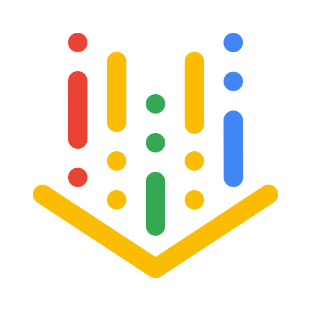
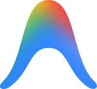
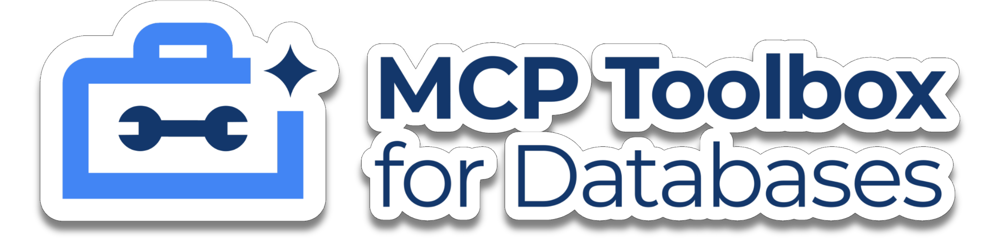

# Ground Beans to Grounded Answers

```{rst-class} hero-tagline
Building Agentic Apps with Google and Oracle.
```

A working reference app that turns one chat message — *"I need something
bold"* — into a grounded answer. The user doesn't say "coffee"; the router
recognizes the idiom, runs a vector search, and grounds the reply in real
menu rows.

::::{grid} 1 1 3 3
:gutter: 2
:class-container: hero-stack

:::{grid-item-card} {octicon}`search;1.2em` Vector search
:class-card: hero-pill

**Oracle 26ai** HNSW index over `VECTOR`.
:::

:::{grid-item-card} {octicon}`workflow;1.2em` Chat routing
:class-card: hero-pill

**Flash-Lite** routes grounded product, store, and availability turns.
:::

:::{grid-item-card} {octicon}`zap;1.2em` Vertex AI
:class-card: hero-pill

`gemini-embedding-2` for retrieval; **Gemini** can assist selection.
:::

::::

```{mermaid}
flowchart TD
    U([User question]) --> C[Litestar chat controller]
    C --> I{Flash-Lite intent}
    I -->|PRODUCT_RAG| P[Product RAG selector]
    I -->|STORE_LOCATION| S[Store lookup]
    I -->|PRODUCT_AVAILABILITY| V[Inventory lookup]
    I -->|GENERAL_CONVERSATION| A[ADK 2.0 workflow]
    P --> O[(Oracle 26ai<br/>HNSW search)]
    S --> O
    V --> O
    A -. optional tool .-> O
    O --> R[Grounded final event]
    A --> R
    R --> U
```

*Product, store, and availability turns are grounded in deterministic service
facts. Product RAG may use structured selection, but final product copy is
rendered from Oracle rows. General conversation falls through to the ADK
workflow, where the model can still use the same closure-bound tools.*

<div class="logo-strip logo-strip-compact" aria-label="Official technology logos">
  
  
  
  
  
  
</div>

## Where to go next

::::{grid} 1 1 2 4
:gutter: 3

:::{grid-item-card} {octicon}`workflow;1.1em` Walkthrough
:link: tour
:link-type: doc

One chat message, end to end: question → embedding → Oracle → streamed
answer.
:::

:::{grid-item-card} {octicon}`database;1.1em` Concepts
:link: concepts/vector-search
:link-type: doc

Vectors in Oracle, RAG, and how the chat router chooses grounded service
calls.
:::

:::{grid-item-card} {octicon}`mortar-board;1.1em` Hands-on lab
:link: lab
:link-type: doc

The single-file workshop guide for running Cymbal Coffee with Oracle 26ai and
Vertex AI.
:::

:::{grid-item-card} {octicon}`terminal;1.1em` Antigravity MCP
:link: mcp-antigravity
:link-type: doc

Clean SQLcl and Google MCP Toolbox configuration for teaching Antigravity
workflows.
:::

::::

```{toctree}
:hidden:
:caption: Concepts

tour
concepts/vector-search
concepts/rag
concepts/agent-flow
maps
```

```{toctree}
:hidden:
:caption: MCP

mcp-antigravity
```

```{toctree}
:hidden:
:caption: Lab

lab
```

```{toctree}
:hidden:
:caption: Reference

reference/quickstart
reference/cli
reference/api
reference/internals
reference/developers
reference/brand-assets
```
