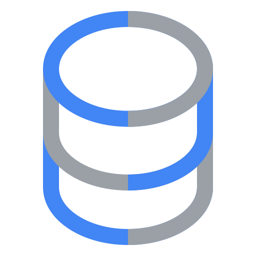

# MCP Configuration And Usage In Antigravity

Antigravity can use MCP servers to give the assistant controlled access to the
same Oracle database used by Cymbal Coffee. For this workshop, keep the setup
clean: configure current Antigravity MCP files directly, avoid legacy Gemini CLI
migration, and never commit credentials.

<div class="logo-strip logo-strip-compact" aria-label="Official MCP-related logos">
  
  
  
  
</div>

::::{grid} 1 1 2 2
:gutter: 3

:::{grid-item-card} {octicon}`terminal;1.2em` SQLcl MCP

Use Oracle SQLcl as the direct MCP bridge for local Oracle SQL operations
against the demo schema.
:::

:::{grid-item-card} {octicon}`database;1.2em` MCP Toolbox Oracle

Use Google's MCP Toolbox Oracle prebuilt profile for database inspection and
toolbox-managed SQL execution.
:::

:::{grid-item-card} {octicon}`cloud;1.2em` Google Cloud Oracle MCP

Use the Google Cloud Oracle Database remote MCP endpoint only when teaching the
managed Google Cloud MCP flow.
:::

:::{grid-item-card} {octicon}`shield-check;1.2em` Safety posture

Use least-privilege demo credentials, preview generated config, and keep all
secrets outside tracked files.
:::

::::

## Config Location

Antigravity reads MCP server entries from the user-level MCP config:

```text
~/.gemini/config/mcp_config.json
```

Do not add project-local MCP config under `.gemini/`. The project can keep
secret-free examples under `.agents/` or `docs/`, but the live Antigravity file
belongs in the user's home directory.

## SQLcl MCP

SQLcl MCP is the shortest path from Antigravity to the local Oracle 26ai demo
schema. It should use the same app-scoped database user that Cymbal Coffee uses,
not `SYS` or `SYSTEM`.

```json
{
  "mcpServers": {
    "sqlcl": {
      "command": "/absolute/path/to/sql",
      "args": ["-mcp"]
    }
  }
}
```

Use an absolute executable path. Agent and desktop environments often start
without the same `PATH` as the terminal shell.

## MCP Toolbox Oracle

Google's MCP Toolbox can run a prebuilt Oracle server:

```json
{
  "mcpServers": {
    "oracle-toolbox": {
      "command": "/absolute/path/to/toolbox",
      "args": ["--prebuilt", "oracledb", "--stdio"],
      "env": {
        "ORACLE_CONNECTION_STRING": "localhost:1521/FREEPDB1",
        "ORACLE_USERNAME": "app",
        "ORACLE_PASSWORD": "<set locally>"
      }
    }
  }
}
```

The prebuilt profile is useful for a workshop because it avoids maintaining a
custom `tools.yaml` before the teaching flow stabilizes. Move to explicit
Toolbox source configuration later if the lab needs a curated tool list.

## Google Cloud Oracle MCP

Google Cloud Oracle Database also exposes a remote MCP endpoint:

```text
https://oracledatabase.googleapis.com/mcp
```

Use this as a separate managed-cloud example. It requires the target Google
Cloud API to be enabled, Application Default Credentials, and a principal with
the MCP tool-caller role.

## Installer Surface To Add

These commands are the intended clean repo interface; they should be added as
explicit installer/configuration actions rather than hidden inside `install all`:

```shell
uv run python manage.py install mcp-toolbox --version 1.5.0
uv run python manage.py install mcp sqlcl --client antigravity --dry-run
uv run python manage.py install mcp oracle-toolbox --client antigravity --dry-run
uv run python manage.py install mcp status
```

The writer should preserve unrelated MCP servers, replace only repo-owned
entries when requested, and avoid reading legacy `~/.gemini/settings.json`.

## Visual References

Use built-in documentation icons first:

- Sphinx Design supports Octicon and Material icon roles for inline SVG icons.
- Sphinx Immaterial supports bundled icon names and custom SVG icon paths.
- GitHub Octicons are MIT licensed.
- Google Material Symbols are Apache-2.0 licensed.

Use official product artwork sparingly:

- Google Cloud provides an official icon library for architecture diagrams and
  technical documentation.
- Oracle logo usage is governed by Oracle's third-party logo and trademark
  guidelines. Prefer generic database icons in this documentation unless an
  approved Oracle asset is already part of the project.

Useful references:

- [Sphinx Design inline icons](https://sphinx-design.readthedocs.io/en/latest/badges_buttons.html#inline-icons)
- [Sphinx Immaterial inline icons](https://sphinx-immaterial.readthedocs.io/en/latest/inline_icons.html)
- [GitHub Octicons](https://github.com/primer/octicons)
- [Google Material Symbols](https://developers.google.com/fonts/docs/material_symbols)
- [Google Cloud icon library](https://cloud.google.com/icons)
- [Oracle logo usage guidelines](https://www.oracle.com/legal/logos/)
- [Local official asset inventory](reference/brand-assets.md)
