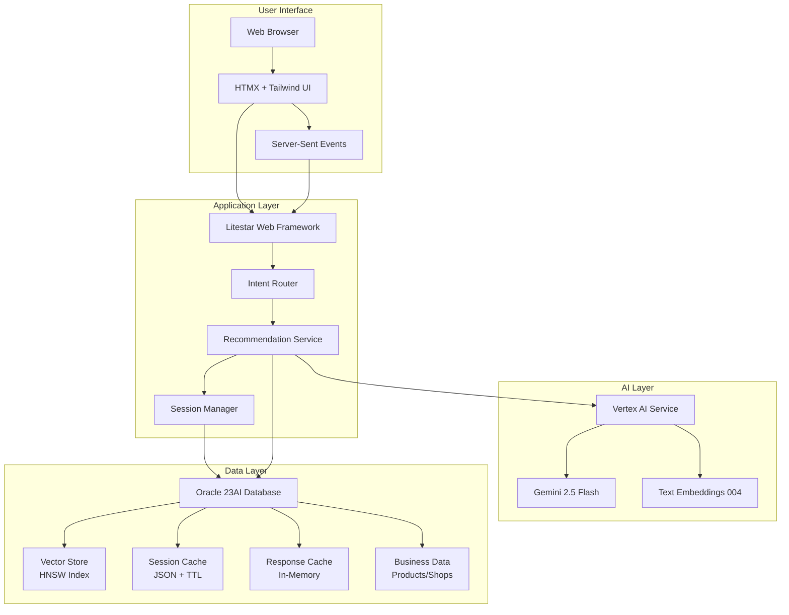
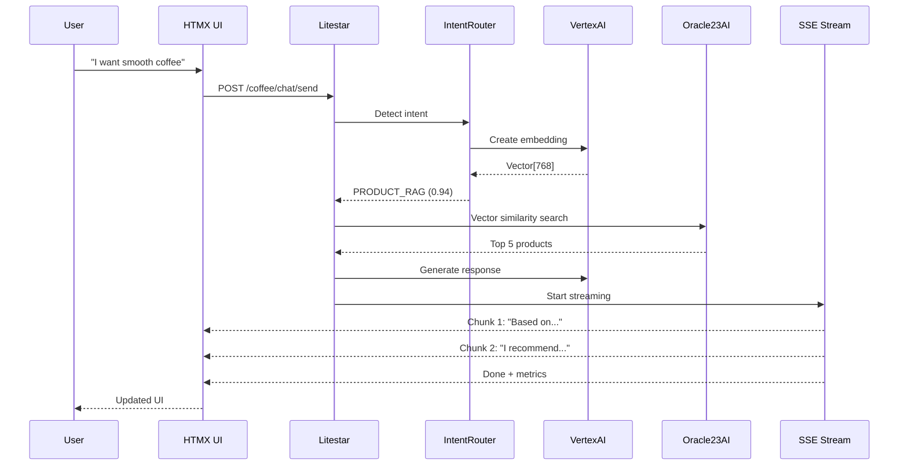
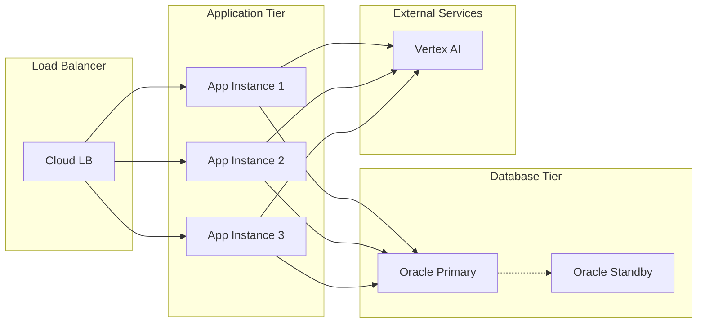

# 🏗️ Complete System Architecture

## High-Level Architecture



## Component Deep Dive

### 1. Frontend Layer (Zero Build Complexity)

**Technology Stack:**
- **HTMX 1.9.10**: Handles all dynamic updates
- **Tailwind CSS**: Utility-first styling via CDN
- **Server-Sent Events**: Real-time streaming responses
- **Jinja2 Templates**: Server-side rendering

**Key Design Decision:** No JavaScript build tools, no npm, no webpack. Just HTML that updates itself.

```html
<!-- Example: Self-updating chat interface -->
<form hx-post="/coffee/chat/send" 
      hx-target="#chat-history" 
      hx-swap="beforeend">
    <input name="message" placeholder="Ask about coffee..." />
    <button type="submit">Send ☕</button>
</form>

<div id="chat-history" 
     hx-ext="sse" 
     sse-connect="/coffee/chat/stream/{query_id}">
    <!-- Messages appear here automatically -->
</div>
```

### 2. Application Layer (Python + Litestar)

**Core Framework:**
- **Litestar 2.x**: Modern async Python web framework
- **oracledb**: Python driver for Oracle Database (async support)
- **msgspec**: High-performance serialization for JSON/DTOs
- **Raw SQL**: Direct database access for clarity and performance

**Service Architecture:**
```python
class RecommendationService:
    """Main business logic orchestrator using raw SQL"""
    
    def __init__(self, 
                 vertex_ai_service: VertexAIService,
                 products_service: ProductService,
                 shops_service: ShopService,
                 session_service: UserSessionService):
        self.vertex_ai = vertex_ai_service
        self.products = products_service
        self.shops = shops_service
        self.sessions = session_service
```

### 3. AI Integration Layer

**Intent Detection System with Cached Embeddings:**
```python
class IntentRouter:
    """Semantic understanding of user queries with database-cached embeddings"""
    
    INTENT_EXEMPLARS = {
        "PRODUCT_RAG": [
            "What coffee do you recommend?",
            "Something smooth and chocolatey",
            "I need a strong espresso"
        ],
        "LOCATION_RAG": [
            "Where are your shops?",
            "Find a store near me",
            "What are your hours?"
        ],
        "GENERAL_CONVERSATION": [
            "Hello!", 
            "Thanks for the help",
            "Tell me a coffee joke"
        ]
    }
    
    async def initialize(self):
        """Load cached embeddings from database on startup"""
        if self.exemplar_service:
            # Check for cached embeddings in database
            cached_data = await self.exemplar_service.get_exemplars_with_phrases()
            if cached_data:
                logger.info("Loaded %d cached embeddings from database", len(cached_data))
                self._initialized = True
                return
            
            # First run - compute and cache embeddings
            logger.info("Populating intent exemplar cache...")
            await self.exemplar_service.populate_cache(
                self.INTENT_EXEMPLARS,
                self.vertex_ai
            )
    
    async def route_intent(self, query: str) -> tuple[str, float, str]:
        # Returns: (intent_type, confidence_score, matched_exemplar)
```

**Vertex AI Integration:**
```python
class VertexAIService:
    """Native Google AI integration"""
    
    def __init__(self):
        # Smart model initialization with fallback
        try:
            self.model = GenerativeModel("gemini-2.5-flash")
            logger.info("✅ Using latest Gemini 2.5")
        except Exception:
            self.model = GenerativeModel("gemini-1.5-flash-001")
            logger.info("⚠️ Using stable fallback")
```

### 4. Data Layer (Oracle 23AI)

**Database Schema:**
```sql
-- Core business data with AI embeddings
CREATE TABLE products (
    id NUMBER GENERATED BY DEFAULT AS IDENTITY PRIMARY KEY,
    name VARCHAR2(200) NOT NULL,
    description CLOB,
    embedding VECTOR(768, FLOAT32),  -- AI magic happens here!
    price NUMBER(10,2),
    created_at TIMESTAMP DEFAULT SYSTIMESTAMP
);

-- Intent exemplar caching for fast startup
CREATE TABLE intent_exemplar (
    id NUMBER GENERATED BY DEFAULT AS IDENTITY PRIMARY KEY,
    intent VARCHAR2(50) NOT NULL,
    phrase VARCHAR2(500) NOT NULL,
    embedding VECTOR(768, FLOAT32),  -- Pre-computed embeddings
    created_at TIMESTAMP DEFAULT SYSTIMESTAMP,
    updated_at TIMESTAMP DEFAULT SYSTIMESTAMP,
    CONSTRAINT uq_intent_phrase UNIQUE (intent, phrase),
    INDEX idx_intent (intent)
);

-- Intelligent session management
CREATE TABLE user_sessions (
    id RAW(16) DEFAULT SYS_GUID() PRIMARY KEY,
    session_id VARCHAR2(128) UNIQUE NOT NULL,
    user_id VARCHAR2(128) NOT NULL,
    data JSON,  -- Flexible session storage
    expires_at TIMESTAMP NOT NULL,
    INDEX idx_session_expires (expires_at)
);

-- Response caching with automatic expiry
CREATE TABLE response_cache (
    cache_key VARCHAR2(256) PRIMARY KEY,
    query_text VARCHAR2(4000),
    response JSON,
    expires_at TIMESTAMP NOT NULL,
    hit_count NUMBER DEFAULT 0
);

-- Performance metrics tracking
CREATE TABLE search_metrics (
    id RAW(16) DEFAULT SYS_GUID() PRIMARY KEY,
    query_id VARCHAR2(128) NOT NULL,
    user_id VARCHAR2(128),
    search_time_ms NUMBER,
    embedding_time_ms NUMBER,
    oracle_time_ms NUMBER,
    similarity_score NUMBER,
    result_count NUMBER,
    created_at TIMESTAMP DEFAULT SYSTIMESTAMP,
    INDEX idx_metrics_time (created_at, search_time_ms)
);
```

## Request Flow Diagram



## Performance Architecture

### Caching Strategy

```python
# Three-tier caching approach
class CacheStrategy:
    """
    L1: Browser Cache (1 min) - Static assets
    L2: Oracle In-Memory (5 min) - Common queries  
    L3: Oracle Disk (24 hrs) - All responses
    """
    
    async def get_or_compute(self, key: str, compute_fn):
        # Check L2 cache first
        cached = await self.oracle_cache.get(key)
        if cached and not cached.expired:
            return cached.value
            
        # Compute and cache
        result = await compute_fn()
        await self.oracle_cache.set(key, result, ttl=300)
        return result
```

### Connection Pooling

```python
# Optimized for Oracle 23AI
oracle_config = {
    "pool_size": 20,
    "max_overflow": 10,
    "pool_timeout": 30,
    "pool_recycle": 3600,
    "pool_pre_ping": True,
    "echo_pool": "debug"
}
```

## Security Architecture

### API Security
- **Rate Limiting**: 100 requests/minute per user
- **CSRF Protection**: Built into Litestar
- **Input Validation**: msgspec with strict schemas
- **SQL Injection**: Parameterized queries only

### Data Security
```python
# Automatic PII handling
class SecureDataMixin:
    @property
    def masked_user_id(self):
        """Never expose raw user IDs"""
        return hashlib.sha256(
            f"{self.user_id}:{settings.SECRET_KEY}".encode()
        ).hexdigest()[:12]
```

## Deployment Architecture

### Development Environment
```yaml
# docker-compose.yml
services:
  oracle-free:
    image: gvenzl/oracle-free:23-slim
    environment:
      ORACLE_PASSWORD: ${ORACLE_PASSWORD}
    ports:
      - "1521:1521"
    volumes:
      - oracle-data:/opt/oracle/oradata
      
  app:
    build: .
    environment:
      DATABASE_URL: ${DATABASE_URL}
      GEMINI_API_KEY: ${GEMINI_API_KEY}
    ports:
      - "5005:5005"
    depends_on:
      - oracle-free
```

### Production Architecture


## Monitoring & Observability

### Key Metrics Dashboard
```python
# Real-time metrics collection
class MetricsCollector:
    async def record_search(self, metrics: SearchMetrics):
        await self.oracle.execute("""
            INSERT INTO search_metrics (
                query_id, user_id, 
                search_time_ms, embedding_time_ms,
                oracle_time_ms, similarity_score,
                result_count, created_at
            ) VALUES (
                :query_id, :user_id,
                :search_time, :embed_time,
                :oracle_time, :similarity,
                :count, SYSTIMESTAMP
            )
        """, metrics.dict())
```

### Health Checks
```python
@get("/health")
async def health_check(
    oracle: OracleService,
    vertex_ai: VertexAIService
) -> dict:
    return {
        "status": "healthy",
        "checks": {
            "database": await oracle.ping(),
            "vertex_ai": await vertex_ai.health_check(),
            "vector_search": await oracle.vector_search_test(),
            "cache_hit_rate": await oracle.get_cache_stats()
        },
        "timestamp": datetime.utcnow()
    }
```

## Error Handling & Resilience

### Circuit Breaker Pattern
```python
class VertexAICircuitBreaker:
    def __init__(self, failure_threshold=5, timeout=60):
        self.failure_count = 0
        self.failure_threshold = failure_threshold
        self.timeout = timeout
        self.last_failure = None
        
    async def call(self, func, *args, **kwargs):
        if self.is_open():
            return await self.fallback()
            
        try:
            result = await func(*args, **kwargs)
            self.on_success()
            return result
        except Exception as e:
            self.on_failure()
            if self.is_open():
                return await self.fallback()
            raise
```

### Graceful Degradation
```python
# Priority levels for fallback
FALLBACK_CHAIN = [
    lambda: vertex_ai.generate_content(prompt),      # Primary
    lambda: get_cached_response(prompt_hash),        # Cache
    lambda: get_static_response(intent_type),        # Static
    lambda: "I'm having trouble right now. Please try again."  # Final
]
```

## Development Workflow

### Local Development
```bash
# 1. Start infrastructure
make start-infra

# 2. Run with hot reload
uv run app run --reload

# 3. Run tests in watch mode
ptw tests/ --now
```

### Code Organization
```
app/
├── controllers/      # HTTP endpoints
├── services/        # Business logic
│   ├── intent_router.py
│   ├── vertex_ai.py
│   └── recommendation.py
├── db/
│   ├── fixtures/    # Sample data JSON files
│   └── models.py    # Data models (if needed)
├── schemas.py       # msgspec DTOs
└── config.py        # Settings management
```

## Performance Optimizations

### 1. Intent Exemplar Caching
```python
# Database-cached embeddings eliminate startup delay
class IntentExemplarService:
    """Manages cached intent exemplar embeddings in Oracle"""
    
    async def populate_cache(self, exemplars: dict, vertex_ai_service):
        """One-time population of exemplar embeddings"""
        count = 0
        for intent, phrases in exemplars.items():
            for phrase in phrases:
                # Check if already cached
                existing = await self.repository.get_one_or_none(
                    intent=intent, phrase=phrase
                )
                if not existing or not existing.embedding:
                    # Generate and cache embedding
                    embedding = await vertex_ai_service.create_embedding(phrase)
                    await self.cache_exemplar(intent, phrase, embedding)
                    count += 1
        logger.info("Populated cache with %d new exemplar embeddings", count)
        return count

# Near-instant startup with cached embeddings
async def initialize_intent_router():
    router = IntentRouter(vertex_ai_service, exemplar_service)
    await router.initialize()  # Loads from cache, no API calls!
    return router
```

### 2. Batch Processing
```python
# Process multiple embeddings in one API call
async def create_embeddings_batch(texts: list[str]) -> list[list[float]]:
    return await vertex_ai.embeddings.create_batch(
        texts, 
        batch_size=100,
        model="text-embedding-004"
    )
```

### 3. Query Optimization
```sql
-- Use Oracle hints for performance
SELECT /*+ LEADING(p) USE_NL(i s) INDEX(p embed_idx) */
    p.*, s.*, i.quantity
FROM products p
JOIN inventory i ON p.id = i.product_id  
JOIN shops s ON i.shop_id = s.id
WHERE VECTOR_DISTANCE(p.embedding, :vector, COSINE) < 0.8;
```

## Scaling Considerations

### Horizontal Scaling
- Stateless application design
- Session affinity not required
- Oracle RAC for database scaling

### Vertical Scaling
- Start: 2 CPU, 4GB RAM
- Growth: 8 CPU, 32GB RAM  
- Max: 32 CPU, 128GB RAM

### Cost Optimization
- Use spot instances for workers
- Schedule heavy jobs off-peak
- Implement request coalescing

## Next Steps

Ready to dive deeper?
- **[AI & RAG Explained](05-ai-rag-explained.md)** - Understand the AI magic
- **[Implementation Guide](06-implementation-guide.md)** - Build it yourself
- **[Operations Manual](07-operations-manual.md)** - Run it in production

---

*"The best architecture is the one that solves your problem with the least complexity. Oracle + AI gives us enterprise capability with startup simplicity."* - Lead Architect