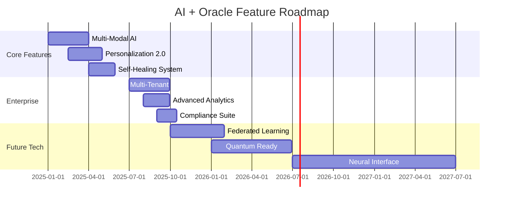

# 🚀 Future Roadmap: What's Next for AI + Oracle

## Vision Statement

By 2026, our Oracle + AI platform will be the foundation for intelligent, self-optimizing applications that understand context, predict needs, and deliver personalized experiences at scale.

## Q1 2025: Enhanced Intelligence

### 1. Multi-Modal Understanding
```python
# Coming soon: Process images, voice, and text together
async def process_multi_modal(image: bytes, voice: bytes, text: str):
    # "Show me coffees that look like this" + photo
    visual_features = await extract_visual_embedding(image)
    voice_intent = await transcribe_and_analyze(voice)
    text_meaning = await get_text_embedding(text)

    return await unified_search(visual_features, voice_intent, text_meaning)
```

**Business Value**:
- Voice ordering: "Hey, I'll have my usual"
- Visual search: Photo → Similar products
- Accessibility: Support for all users

### 2. Personalization Engine
```sql
-- User preference learning
CREATE TABLE user_preferences (
    user_id VARCHAR2(128),
    preference_embedding VECTOR(768),
    learned_at TIMESTAMP,
    confidence_score NUMBER
);

-- Real-time preference updates
MERGE INTO user_preferences
USING (SELECT :user_id, :new_embedding, SYSTIMESTAMP, :score FROM dual)
ON (user_id = :user_id)
WHEN MATCHED THEN UPDATE SET ...
WHEN NOT MATCHED THEN INSERT ...;
```

**Features**:
- Learn from every interaction
- Predict next purchase
- Personalized recommendations
- Privacy-first design

### 3. Advanced Intent Understanding
- Multi-intent queries: "Find a strong coffee near me that's good with dessert"
- Context carryover: Remember conversation history
- Emotion detection: Understand urgency, frustration, excitement
- Cultural adaptation: Respond appropriately to different regions

## Q2 2025: Operational Excellence

### 1. Self-Healing System
```python
class SelfHealingOrchestrator:
    async def detect_anomaly(self):
        # Monitor performance degradation
        if response_time > threshold:
            await self.diagnose_issue()
            await self.apply_fix()
            await self.verify_resolution()

    async def auto_optimize(self):
        # Rebuild indexes when needed
        # Adjust cache strategies
        # Scale resources dynamically
```

### 2. Predictive Scaling
```yaml
# Kubernetes HPA with ML predictions
apiVersion: autoscaling/v2
kind: HorizontalPodAutoscaler
metadata:
  name: ai-predictive-scaler
spec:
  metrics:
  - type: External
    external:
      metric:
        name: predicted_load
        selector:
          matchLabels:
            model: "traffic-predictor-v2"
```

### 3. Zero-Downtime Everything
- Blue-green deployments with AI verification
- Automatic rollback on performance regression
- Database migrations without service interruption
- Model updates with gradual rollout

## Q3 2025: Enterprise Features

### 1. Multi-Tenant Architecture
```sql
-- Virtual Private Database for isolation
CREATE OR REPLACE FUNCTION tenant_isolation_policy(
    schema_name VARCHAR2,
    table_name VARCHAR2
) RETURN VARCHAR2 AS
BEGIN
    RETURN 'tenant_id = SYS_CONTEXT(''APP_CTX'', ''TENANT_ID'')';
END;

-- Apply to all tables
BEGIN
    DBMS_RLS.ADD_POLICY(
        object_name => 'products',
        policy_name => 'tenant_isolation',
        policy_function => 'tenant_isolation_policy'
    );
END;
```

### 2. Advanced Analytics Dashboard
```python
# Real-time business intelligence
class AIAnalytics:
    async def generate_insights(self):
        return {
            "trending_queries": await self.identify_trends(),
            "unmet_needs": await self.find_gaps(),
            "revenue_opportunities": await self.predict_revenue(),
            "customer_segments": await self.cluster_users(),
            "optimization_suggestions": await self.recommend_improvements()
        }
```

### 3. Compliance & Governance
- GDPR/CCPA automated compliance
- Audit trail with blockchain verification
- Data lineage tracking
- Automated PII detection and handling

## Q4 2025: Next-Gen Capabilities

### 1. Federated Learning
```python
# Train models without moving data
class FederatedLearning:
    async def train_locally(self, tenant_data):
        # Train on tenant's data locally
        local_model = await self.create_model()
        await local_model.fit(tenant_data)

        # Share only model updates, not data
        return local_model.get_gradients()

    async def aggregate_globally(self, all_gradients):
        # Combine learning from all tenants
        global_model = await self.merge_gradients(all_gradients)
        return global_model
```

### 2. Quantum-Ready Architecture
```sql
-- Prepare for quantum computing
CREATE TABLE quantum_ready_vectors (
    id NUMBER,
    classical_embedding VECTOR(768),
    quantum_state BLOB,  -- Quantum state representation
    compatibility_score NUMBER
);

-- Quantum-classical hybrid search
SELECT * FROM products
WHERE QUANTUM_SIMILARITY(quantum_state, :query_state) > 0.9
   OR VECTOR_DISTANCE(classical_embedding, :classic_vector) < 0.2;
```

### 3. Edge AI Integration
```javascript
// Client-side AI for instant responses
class EdgeAI {
    constructor() {
        this.model = await loadModel('coffee-intent-mini');
        this.cache = new LocalCache();
    }

    async process(query) {
        // Instant local processing
        const intent = await this.model.predict(query);

        if (confidence > 0.95) {
            return this.cache.get(intent);
        } else {
            return this.callServer(query);
        }
    }
}
```

## 2026 and Beyond

### Autonomous Business Operations
```python
class AutonomousCommerce:
    """Self-running business operations"""

    async def manage_inventory(self):
        # Predict demand
        demand = await self.forecast_demand()

        # Optimize orders
        orders = await self.optimize_purchasing(demand)

        # Execute autonomously
        await self.place_orders(orders)

        # Monitor and adjust
        await self.continuous_optimization()
```

### Neural Interface Integration
- Think your query, get results
- Emotional state recognition
- Predictive assistance
- Seamless human-AI collaboration

### Quantum AI Advantages
- Search billions of products in microseconds
- Perfect personalization with quantum superposition
- Unbreakable security with quantum encryption
- Solve optimization problems instantly

## Technology Adoption Timeline



## Investment Requirements

### Phase 1: Enhanced Intelligence (Q1-Q2 2025)
- Team: +2 ML Engineers, +1 UX Designer
- Infrastructure: GPU cluster for model training
- Budget: $250K
- ROI: 18 months

### Phase 2: Enterprise Features (Q3-Q4 2025)
- Team: +3 Backend Engineers, +1 Security Expert
- Infrastructure: Multi-region deployment
- Budget: $400K
- ROI: 12 months

### Phase 3: Next-Gen Capabilities (2026+)
- Team: +5 Researchers, +2 Quantum Specialists
- Infrastructure: Quantum computing access
- Budget: $1M
- ROI: 24-36 months

## Success Metrics

### Technical KPIs
- Response time: <20ms by 2026
- Accuracy: 99%+ intent detection
- Scale: 1B+ queries/day capability
- Cost: <$0.0001 per query

### Business KPIs
- Customer satisfaction: 95%+
- Revenue per user: +200%
- Support cost reduction: 90%
- Time to market: 75% faster

## Risk Mitigation

### Technology Risks
- **AI Model Drift**: Continuous learning pipeline
- **Quantum Transition**: Hybrid architecture ready
- **Privacy Concerns**: Zero-knowledge proofs
- **Vendor Lock-in**: Open standards adoption

### Business Risks
- **Competition**: Stay 18 months ahead
- **Regulation**: Proactive compliance
- **Talent**: University partnerships
- **Cost Overruns**: Phased approach

## Call to Action

The future of AI-powered applications is here. Each quarter brings new capabilities that transform how businesses operate and serve customers. The question isn't whether to adopt these technologies, but how quickly you can leverage them for competitive advantage.

### Immediate Next Steps
1. **Q1 Planning Session**: Define your AI roadmap
2. **Pilot Program**: Test multi-modal features
3. **Team Training**: Upskill for AI-first development
4. **Partnership**: Join our early adopter program

### Get Involved
- **Developer Preview**: Access beta features
- **Research Collaboration**: Shape the future
- **Community**: Join our AI + Oracle forum
- **Updates**: Subscribe to our roadmap newsletter

---

*"The best way to predict the future is to build it. With Oracle + AI, we're not just building applications - we're creating intelligent systems that understand, learn, and evolve."* - Chief Innovation Officer
